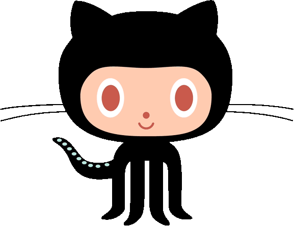

# Hi, I'm Roan  
A JS/Java developer from Erechim, Brazil.

### About me 
- 🎓 Analysis and systems development (IDEAU RS).
- 💼 Working as Software Developer.  
- 🌱 I’m currently learning Spring Boot and React.  

### My Skill Set  

  
  &nbsp;&nbsp;
  
  &nbsp;&nbsp;
  
  &nbsp;&nbsp;
  
  &nbsp;&nbsp;
  
  &nbsp;&nbsp;
  
  &nbsp;&nbsp;
  
  &nbsp;&nbsp;
  
  &nbsp;&nbsp;
  

### Contacts

  
  

###

  
  

